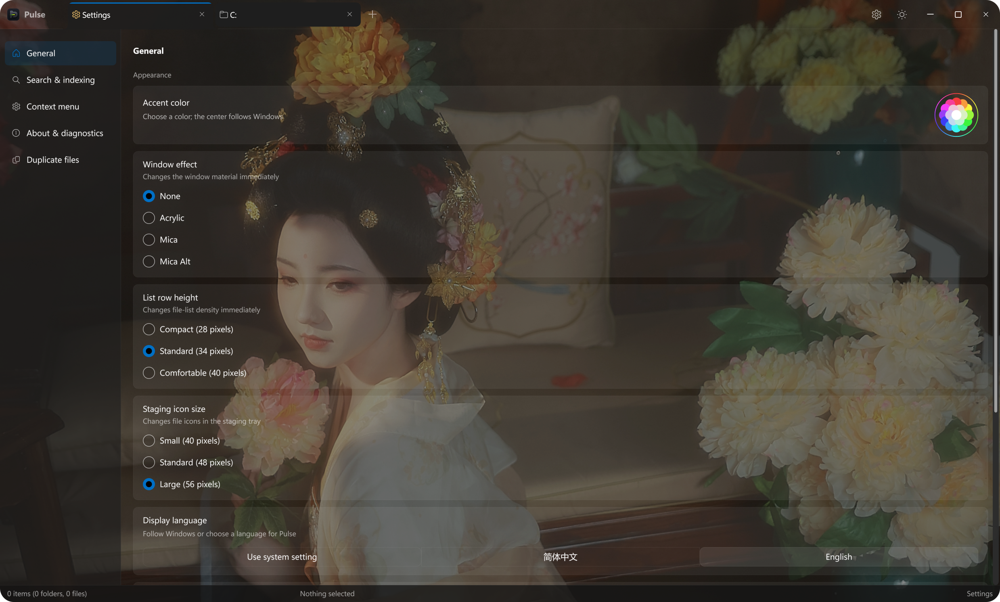
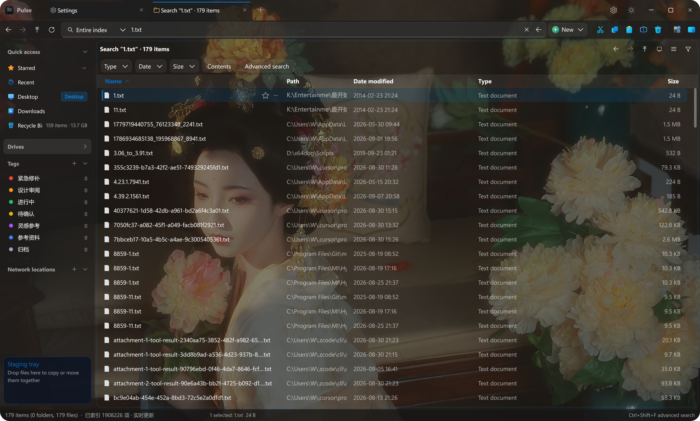
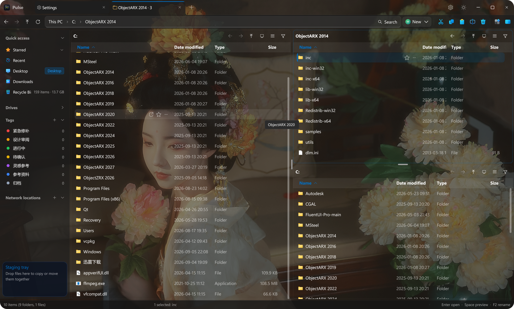

# Pulse

**为 Windows 打造的文件管理器，让浏览、搜索和整理文件更顺手。**

多标签与多窗格、快速索引搜索、文件预览和可自定义外观，放在同一个工作空间里。

[下载最新版](https://github.com/jimmgreen/pulse/releases/latest) · [查看更新记录](https://github.com/jimmgreen/pulse/releases) · [反馈问题](https://github.com/jimmgreen/pulse/issues)

## 下载与安装

在发布页按系统选择安装包：

| 版本 | 适用系统 | 安装包 |
| --- | --- | --- |
| Windows 版（64位） | Windows 10 / Windows 11 | `PulseSetup-版本.exe` |
| Windows 8.1 兼容版（64位） | Windows 8.1 | `PulseSetup-版本-win81.exe` |

运行安装包，按向导完成安装。安装时可以启用 PulseIndex 服务，用于全盘索引搜索。

## 让工作空间适合你

支持浅色、深色主题与壁纸背景，可以调整外观，在熟悉的目录结构中浏览文件。



## 更快找到文件

通过索引搜索文件名，结合路径、类型等条件缩小范围；也可以搜索文件内容。搜索结果直接展示所在位置，方便继续浏览和操作。



## 多个目录，一起处理

使用多窗格并排查看目录，用标签页保留工作位置。配合文件预览、标签、暂存区和重复文件查找，完成日常整理。



## 自动更新

Pulse 会在启动后自动检查新版。有更新时，窗口内会出现提示；点击提示即可下载安装包，校验通过后打开安装向导。也可以在「设置 → 关于与诊断」中手动检查更新。

下载可以取消，安装时按 Windows 提示确认管理员权限。普通版和 Windows 8.1 兼容版分别获取适用的更新。

**1.0.2 及更早版本需要先手动安装一次 1.0.3 或更新版本，之后即可收到自动更新提示。**

## 从源码构建

使用 Windows x64、Visual Studio C++ 工具、CMake 3.25+ 和 Ninja。发布构建另需 PowerShell 7.2+ 与 Inno Setup 6。

开发构建：

```powershell
.\build_release.bat
.\build\pulse.exe
```

生成与正式发布相同的安装包，并运行回归检查：

```powershell
pwsh ./scripts/build_release_ci.ps1 -Channel windows
pwsh ./scripts/build_release_ci.ps1 -Channel win81 -BuildDir build-ci-win81
```

发布脚本使用 Visual Studio 2022 v143，并自动下载、校验固定版本的 LumaText SDK。开发构建可通过 `LUMATEXT_SOURCE_DIR` 指定源码；未找到 LumaText 时使用 DirectWrite。

技术栈为 C++20、Win32、Direct2D 和 DirectComposition。文件系统、索引、预览与 Shell 任务分别放在对应模块，避免阻塞界面。

更多说明：[自动更新与发布](docs/automatic-updates.md) · [Windows 兼容性](docs/windows-compatibility.md) · [索引存储与迁移](docs/index-migration.md)
