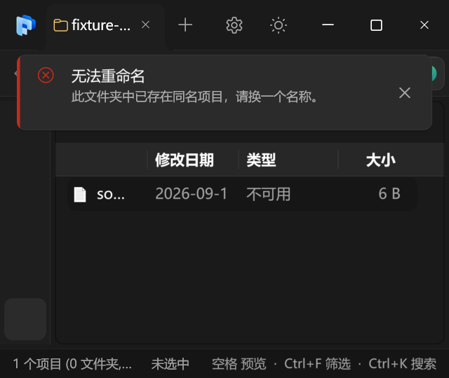
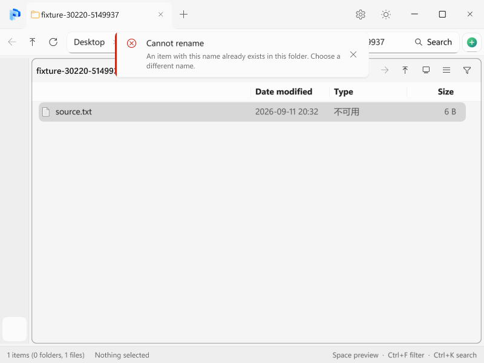

# PR #1：原地重命名实测与修复

基线：`main` 的 `21cfafb`；贡献者 PR 版本：`f0092b4`。采用 PR 的原地改名、编辑器销毁保护、原生光标及无副作用命中测试思路，保留主分支已有的空白点击提交和过滤框行为。

## 文件操作规则

- 重命名只接受一个文件名，不接受路径、保留设备名或 Windows 不允许的名称。
- 大小写变化必须真正提交到文件系统，文件和文件夹均保留撤销能力。
- 批量操作在项目之间检查取消；已完成项目可撤销，未处理项目保持原状。
- 已存在的目标不能被静默覆盖。文件被占用或权限不足时报告失败，不再回退到当前会抑制确认的 Shell 重命名流程。
- 此取舍意味着失败的改名不会再尝试 Shell 扩展或权限提升处理。

## 测试入口

仅构建 `pulse_rename_ops_test` 和 `pulse`。主程序测试构建需启用 `PULSE_WITH_SELFTEST=ON`。

```powershell
.\build\pulse_rename_ops_test.exe
.\build\pulse_rename_ops_test.exe --startup-stop
.\build\pulse_rename_ops_test.exe --shell-roundtrip
$env:PULSE_SELFTEST_CASE = 'rename-editor'
$env:PULSE_LUMATEXT = '0' # 原生文本；改为 1 检查 LumaText
.\build\pulse.exe --selftest
```

文件操作使用 `bench_data` 下本次进程创建的独立目录，界面测试使用离屏窗口及真实编辑器。空白点击用例直接检查编辑状态、窗口可见性和磁盘文件名，没有额外调用提交函数来使断言通过。

## 已复现的问题

- PR 原版操作链路出现 4 个失败断言：文件大小写、目录大小写、输入子路径误移动、批量取消。
- 冲突回退实测中源文件消失、目标仍存在，操作报告完成；因此移除了不安全的 Shell 回退。
- 主分支原生编辑器获得焦点后，系统光标被隐藏；修正为仅在 LumaText 自绘光标时隐藏。
- 快路径改名立即完成后停止操作线程，触发连接建立与关闭并发，退出测试卡住；必须连同生命周期一起检查。

测试原始日志保留在本地 `bench_data/pr1-rename-*.log` 与 `bench_data/pr1-ui-*.log`。不将第一次界面测试的目录字符串比较失败当作产品问题：测试已改为比较导航模型归一化后的原路径。

## 修复后的定向结果

- 文件操作：53 项通过；文件/目录改名、大小写、撤销、非法名称、批量中途取消、冲突及占用失败。
- 启停生命周期：20 轮立即启动、真实改名、停止，共 40 项断言通过，不添加启动等待来绕过竞争。
- 正常 Shell 往返：3 项通过，新建文件收到完成响应、提交 Ping、随后再次新建并收到完成响应。
- `rename-editor`：原生文本和 LumaText 各 13 项通过，均退出 0；涵盖实际磁盘改名、空白点击提交、编辑器关闭、立即停止、重复打开地址/改名编辑器及清理。
- `filter-controls`：19 项通过，退出 0；保留外部点击失焦、清空恢复内容、`1#` 字面匹配、滚动复位及 100%/150%/200% 紧凑布局。
- `rename-outside`：3 项通过，退出 0。
- 原生光标检查读取实际 GUI 线程焦点、光标窗口及系统光标可见状态；LumaText 模式检查真实编辑器焦点。没有把系统光标检查当作 LumaText 像素渲染验收。

正常 Shell 往返使用独立进程，避免连续启停测试留下的既有连接重试节流。用新建文件收到 `Done` 且磁盘文件存在证明响应成功；`Ping()` 只表示请求提交，不能单独证明连接已就绪。

## 验证边界

本轮不运行完整历史测试。离屏窗口检查不等同于人工桌面视觉验收；没有执行真实覆盖安装、UNC/网络共享、第三方 Shell 扩展或权限提升场景。

## 1.0.13 后续视觉修复

上面的结果记录首次整合时的检查。随后桌面实测确认：LumaText 已生成文件名位图，但 layered 子窗口的上传呈现路径没有正常显示；重复刷新未解决。重命名编辑器改用 Windows 重定向 HDC 呈现，并在文本和选区变化后立即更新自绘内容。

后续定向检查覆盖浅色 100%、深色 150% 和原生文本回退；桌面像素检查确认首次打开、重绘、重新布局、鼠标选择及替换输入后文字可见，初始选区正确。用户已确认实际界面修复。

| 重命名输入框修复前 | 修复后（选中文件名，保留扩展名） |
| --- | --- |
|  |  |

操作失败改为顶部 toast，使用本地化正文、单个错误图标及带 12 DIP 右边距的关闭按钮。`PULSE_SELFTEST_CASE=operation-toast` 使用真实重名冲突和隔离测试窗口，验证无模态对话框、Esc 关闭、同一失败不重复弹出、六秒自动消失及文件保留。已检查中英文、深浅主题和 150% 窄窗口渲染截图。





本轮构建及 `operation-toast`、本地化检查退出 0。发布 CI 按 1.0.13 范围运行重命名、启停与 Shell 往返、子编辑器、原生/LumaText 编辑器、toast、过滤控件和空白点击检查，另保留安装器及更新清单检查。CI 的离屏用例不宣称完成桌面像素验收；上述桌面验证在本地完成。
