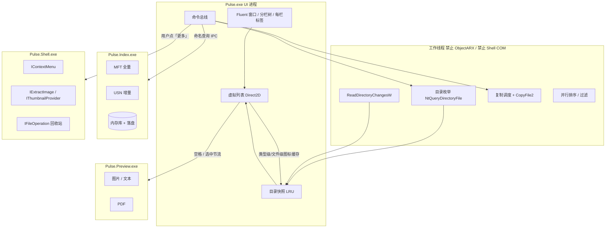

# 高性能 Windows 资源管理器方案

工作名：**Pulse**  
定位：独立桌面产品，不替换 `explorer.exe` 桌面/任务栏，只替换「打开文件夹、浏览、搜索、复制移动」这条日常路径。  
原则：**列表永远不堵，Shell 永远隔离，云永远按需，搜索永远走索引。观感按 Win11 Fluent 做满，但不走 WinUI 这条慢路。**

本文回答四件事：Win11 资源管理器为什么越用越慢、哪些项目值得抄、性能和美观如何同时成立、以及推荐技术栈。

---

## 1. 问题：Explorer 慢，不是「优化不够」

Win11 资源管理器的痛点已经不是个别 bug，而是架构债叠在一起：


| 根因                                        | 日常表现                                  |
| ----------------------------------------- | ------------------------------------- |
| Win32 内核外面再套一层 WinUI / XAML Islands       | 启动、工具栏、右键菜单都有一帧到数秒的「空窗」               |
| 几乎所有浏览都走 Shell 命名空间（`IShellFolder` / COM） | 进文件夹 = 枚举 + 属性处理器 + 缩略图 + 云占位 + 第三方扩展 |
| 默认 Home 页拉 OneDrive / Office.com          | 本地盘也被网络拖死，出现 Working on it            |
| 右键菜单同步加载全部 Shell 扩展                       | 7-Zip、NVIDIA、网盘、杀毒任意一个卡住，整窗卡住         |
| 缩略图 / 属性 / 预览靠近 UI 线程                     | 图片文件夹、视频文件夹、网络盘一滚就卡                   |
| 断网映射盘 30s 超时打到 UI                         | 一个坏盘拖死整个窗口                            |
| `explorer.exe` 同时管桌面、任务栏、托盘               | 资源管理器卡 = 系统壳卡                         |
| 微软的对策是后台预加载（约 30–40MB）                    | 只掩盖启动，不修导航、右键、枚举                      |


结论：**不要做「套了 WinUI 的 Explorer」**。Files.community 已经证明，用微软那套 XAML 去换现代外观，会把同样的税再交一遍。要做的是一台**自己掌握 I/O、GPU 自绘 Fluent、按需才碰 Shell** 的文件管理器——看起来是 Win11，用起来比 Win10 Explorer 还快。

---


## 2. 产品边界


### 做

- 本地 NTFS / ReFS 极速浏览，10 万级目录不卡滚动
- Win11 Fluent 观感（Mica、圆角、深浅色、强调色），与速度同时验收
- **多栏布局**（1–4 栏预设，架构不写死两栏）+ 每栏独立标签 + 键盘优先
- 即时文件名搜索（Everything 级）+ `Ctrl+K` 命令面板（命令/跳转/搜索统一入口）
- **暂存托盘**：`Ctrl+C` / 拖入即收集，导航到目标后一步释放，代替开两窗对拷
- **色彩标签**（访达式）：拖到侧栏标签即打标，标签即虚拟目录
- **工作区**：钉项目根，恢复布局快照；`Ctrl+P` 项目内模糊跳文件夹
- **网络位置**：内网共享先出持久化快照再后台刷新，离线可浏览缓存
- 复制引擎：`CopyFile2` **做单文件传输（保 ADS/ACL/稀疏/加密，走内核快速路径与 ReFS block cloning），自研只做调度层**（队列、暂停、冲突、校验）；v1 先经 Shell 进程走 `IFileOperation`
- 双击打开、剪贴板与 Explorer 互通（`CF_HDROP` + `CFSTR_PREFERREDDROPEFFECT`）、`Ctrl+Z` 撤销栈——这三件是及格线，进 MVP
- 空格预览（独立进程）
- 长路径、符号链接、junction 正确处理
- **单实例**：外部程序「在文件管理器中显示」转发到已运行实例开新标签
- 可选：接管「用资源管理器打开文件夹」


### 明确不做（至少 v1 不做）

- 替换桌面 / 任务栏 / 开始菜单
- 完整 Shell 命名空间（控制面板、所有虚拟文件夹）
- 把主列表做成 WebView2 / Electron / WinUI 3（外观可以靠自绘 Fluent 达到，不必交框架税）
- 默认加载全部第三方右键扩展
- 鼠标划过就注水 OneDrive 占位文件
- 第一天对标 Directory Opus 的全部功能

CAD / 工程图纸是自然差异化（本仓库用户场景）：图纸目录动辄几千个 DWG，Explorer 枚举 + 缩略图会直接跪。Pulse 先保证「进目录瞬间出列表」，DWG 预览放到后期插件，不进主路径。

---


## 3. 开源与竞品：抄什么、不抄什么


| 项目                                                          | 栈             | 该吸收                                                     | 不该吸收                                        |
| ----------------------------------------------------------- | ------------- | ------------------------------------------------------- | ------------------------------------------- |
| [voidtools Everything](https://www.voidtools.com/)          | C，闭源          | MFT 一次性建库 + USN Journal 增量；内存库 + 持久化；搜索编译成字节码；未索引字段按需采集 | 把它当文件管理器；把所有属性都塞进索引                         |
| [File Pilot](https://filepilot.xyz/)                        | 原生，闭源         | 性能即产品；自绘 UI；进目录即出；子树扁平查看；不走 WinUI                       | 功能堆满再谈速度；预览范围过大拖累主进程                        |
| [OneCommander](https://onecommander.com/)                   | DirectX 自绘，闭源 | 明确拒绝 UWP/Electron/WinUI；多栏/Miller 列；长路径                 | 选项爆炸，学习曲线当默认体验                              |
| [Directory Opus](https://www.gpsoft.com.au/)                | 原生 C++        | 10 万文件不卡；**一窗多个 file display，不限死双栏**；深度可脚本化             | 第一版就做全能工作台                                  |
| Q-Dir                                                       | Win32         | **四栏是默认卖点**，复制在栏与栏之间完成                                  | 界面偏旧，性能一般                                   |
| Total Commander                                             | Win32         | 双栏工作流成熟；键盘流；插件生态活了 30 年                                 | 写死左右两栏；1990 年代 UI                           |
| [Sally / Open Salamander](https://github.com/0xeb/sally)    | C++ / CMake   | 双栏 + 插件进程边界；Unicode / 长路径 / 暗色；归档查看器                    | 重插件包袱拖慢 MVP；栏数固定                            |
| [Double Commander](https://github.com/doublecmd/doublecmd)  | Lazarus/Qt    | 跨平台双栏、内置比较/查看器                                          | Qt 对 Windows 观感与启动开销；栏数固定                   |
| [Files.community](https://github.com/files-community/Files) | C# / WinUI 3  | 标签、Git、标签系统、预览面板的产品 completeness；**Shell 预览进独立 HWND**   | **主 UI 用 WinUI**；把 `IContextMenu` 全塞进 UI 进程 |
| [EdenExplorer](https://github.com/mtucciarone/edenexplorer) | Rust + egui   | NT 级枚举、进程极瘦                                             | egui 观感难当日常壳；生态太新                           |
| [yazi](https://github.com/sxyazi/yazi)                      | Rust TUI      | 异步枚举；预览 worker 隔离；任务队列；预取                               | TUI 不是 Windows 日用目标                         |
| QuickLook / Seer / PowerToys Peek                           | 独立进程          | 空格预览必须 out-of-process，崩溃不影响列表                           | 预览器耦合进主进程                                   |
| Listary / Everything SDK                                    | 索引叠加          | 系统级「跳转到文件夹」；后期可挂钩打开/保存对话框                               | 一开始就做全局钩子                                   |


一句话归纳：

- **速度**：Everything 的索引 + File Pilot / OneCommander 的自绘 + NtQueryDirectoryFile 的枚举。
- **工作流**：栏是一等公民（Q-Dir 四栏、Directory Opus 任意分栏）；键盘在栏之间跳，而不是绑死左右。Miller 列是「单栏里的深度导航」，和多栏是两件事。
- **隔离**：yazi 的 worker、Files 的「Shell 预览另开 HWND」——但我们比 Files 更狠，**右键扩展也出进程**。
- **不要**：Files / Win11 Explorer 的 WinUI 主路径。外观照抄 Fluent，实现不走 XAML。

---


## 4. 性能和美观必须同时要

这不是取舍题。Win11 Explorer 给人「现代但钝」的感觉，是因为**用错了实现美观的方式**，不是因为圆角、Mica、深色主题本身贵。


| 错觉                            | 事实                                                                                       |
| ----------------------------- | ---------------------------------------------------------------------------------------- |
| 要好看就得上 WinUI / XAML / Web     | OneCommander、File Pilot、Windows Terminal 都证明：DirectX/Direct2D 自绘可以既像 Win11，又比 Explorer 快 |
| 要快就得做成 Total Commander 那种老 UI | 老的是控件树和 Shell 同步 I/O，不是像素风格                                                              |
| 动画一定掉帧                        | 位移动画放 DirectComposition / DWM 合成器线程，不重新布局 10 万行，120Hz 几乎免费                               |
| 自绘 = 简陋工具风                    | 自绘只是「谁画」；画什么由设计 token 决定，可以像素级对齐 Win11                                                   |


**美观的预算花在用户能看见的地方：**

- Win11 窗口：圆角、Mica / Desktop Acrylic、系统强调色、深浅色跟随、Snap Layouts 标题栏
- 字体与图标：Segoe UI Variable、Segoe Fluent Icons，文件类型图标仍用系统 `imageres.dll`
- 4px 间距基数（8px 为常用倍数）、合理留白、hover / press / focus 状态清晰；工具窗口紧凑，但材质、圆角、图标和动效按产品级做满（token 数值以 `ui.md` §3 为唯一事实源）
- 列表、标签、菜单、滚动条都按 Fluent 控件规格自绘，高 DPI（100/125/150/200%）无糊
- 过渡：标签切换、栏宽、预览开合用 150–200ms ease-out；**用户再输入立即取消动画**

**美观的预算绝不花在这些地方：**

- 为了一个圆角按钮引入整棵 XAML 视觉树
- 主文件列表进 Chromium，用 DOM 虚拟滚动冒充原生
- Home 页为了「推荐」去打 Office.com
- 每行一个 UI 控件、每帧重新 measure/arrange

验收上一句话：**侧拍对比 Win11 Explorer，Pulse 要更好看或至少同等精致；同一目录滚动和右键，Pulse 要明显更快。** 两样都达不到，这个项目就不算做成。

---


## 5. 推荐技术栈

一句话：**C++20 + MSVC/CMake/Ninja + Win32 HWND + Direct2D/DirectWrite/DirectComposition 自绘 Fluent + 三进程（Index / Preview / Shell）。**

先定死，避免做着做着变回 Explorer，也避免做成「很快但像调试器」。

### 5.1 总表


| 层        | 推荐                                                                                                                      | 不选                                    | 原因                                         |
| -------- | ----------------------------------------------------------------------------------------------------------------------- | ------------------------------------- | ------------------------------------------ |
| 语言 / 标准  | **C++20**，`/utf-8`，`/permissive-`                                                                                       | C# 作主程序、Rust 作主程序                     | 零 GC；Win32/NT/COM 无 marshalling；与现有工程能力同构  |
| 编译器 / 构建 | **MSVC x64**、**CMake + Ninja**、VS 2022/2026                                                                             | MinGW 主构建、手写巨型源清单                     | 官方 Windows SDK、WIL、C++/WinRT 都按 MSVC 验证    |
| 目标系统     | Windows 10 22H2 + Windows 11 x64                                                                                        | 32 位、Win7                             | Mica / 圆角在 Win11 启用，Win10 降级到纯色标题栏         |
| 窗口       | **Win32 HWND** + 自绘非客户区                                                                                                 | WinUI 3 窗口、WPF、Qt Quick、Electron      | 拖放、IME、UIA、DWM backdrop 都挂在 HWND 上最稳       |
| 渲染       | **Direct3D 11 + Direct2D 1.3 + DirectWrite + DirectComposition**                                                        | GDI 主路径、Skia 全量、Win2D、XAML            | GPU 画列表；文字走 DirectWrite；动画走合成器             |
| 外观       | **Fluent 设计 token 自绘**（Mica、圆角、强调色、Fluent Icons）                                                                        | 真 WinUI 控件树                           | 看起来是 Win11，运行时没有 XAML Islands              |
| 列表       | 自有 **virtual list**（details / icons / tiles）                                                                            | `SysListView32` 作为长期方案、WinUI ListView | 10 万行只持有 POD 数组；`LVS_OWNERDATA` 仅可作阶段 0 对照 |
| 主题       | `UISettings` / `ShouldAppsUseDarkMode` + DWM backdrop                                                                   | 手写一套与系统脱节的配色                          | 跟随系统深浅色和强调色                                |
| IPC      | 命名管道传控制消息 + **共享内存传结果集**（索引进程写、UI 只读，分页/增量协议）                                                                           | COM 作为进程间主协议；大结果集逐条走管道序列化             | 百万级命中回传不卡在序列化上；COM 只活在 Shell 进程里           |
| 索引       | 自研内存库 + 落盘；可选 **Everything SDK** 作加速后端                                                                                  | Windows Search 当主搜索                   | MFT + USN；无管理员时降级或复用 Everything            |
| 配置       | JSON（utf-8）+ 原子替换保存                                                                                                     | 注册表当主配置                               | 可备份、可 diff、可便携模式                           |
| 日志       | 异步文件日志 + ETW 提供商                                                                                                        | 每行 `OutputDebugString`                | 性能问题靠 ETW 抓，不靠刷盘                           |
| 测试       | **doctest** 测 FS/排序/索引；**benchmark harness 进 CI 当门禁**（脚本驱动开目录/滚动/右键，录帧时间与首帧，超预算 10% 即红）；测试目录用生成器脚本产出（1 万/10 万文件），机器间可复现 | 把 ObjectARX 链进测试；预算只写在文档里没有执行机制       | 回放真实「几万 DWG 的盘」                            |
| 设置页      | 阶段 1 自绘设置；阶段 4+ **可选** WebView2 + Svelte                                                                                | 主窗口 WebView2                          | 低频复杂表单才配用前端栈                               |
| 安装 / 更新  | 单目录便携 + 可选 `msix`/`appinstaller`；便携版启动时检查新版并提示下载，不做静默自更新                                                                | 必须商店、必须服务才能启动 UI                      | 索引服务可装可不装                                  |


### 5.2 关键库（尽量少，且都是边界清晰的）


| 库                                              | 用途                                        |
| ---------------------------------------------- | ----------------------------------------- |
| [WIL](https://github.com/microsoft/wil)        | `unique_handle` / COM RAII，避免手写 `Release` |
| Windows SDK 10.0.22621+                        | D2D、DWrite、DComp、DWM、NT API               |
| C++/WinRT（**仅调用** `UISettings`、云文件等 WinRT API） | 不要引入 WinUI 控件                             |
| 自研 `DirEnum` / `UsnWatch`                      | 不引入额外 FS 框架                               |
| sqlite 仅当索引落盘需要查询时；默认优先自定义 mmap 库              | Everything 证明专用库更省                        |
| WIC (`IWICImagingFactory`)                     | 预览进程解码图片，不进 UI 进程                         |
| `IFileOperation` / `IContextMenu`              | **只**在 `Pulse.Shell.exe`                  |
| doctest                                        | 纯算法与 FS 单测                                |


不引入：Qt、Boost 整包、Skia、CEF、Dear ImGui（原型可玩，产品观感不对）、egui。

### 5.3 渲染与 Fluent 怎么同时做

```text
Win32 消息循环
  └─ 根 HWND（DWMWA_SYSTEMBACKDROP_TYPE = Mica）
       ├─ DirectComposition 视觉树（标签滑动、预览开合、菜单淡入）
       └─ DXGI SwapChain + Direct2D
            ├─ DirectWrite：Segoe UI Variable（正文）、Segoe Fluent Icons（控件）
            ├─ 虚拟列表：只 rasterize 可视行 + 1 屏预取
            ├─ 系统强调色、深浅色 brush 缓存
            └─ 文件图标 atlas（类型级/文件级双键 → GPU 纹理，按需从 Shell 进程回填）
```

要点：

1. **一帧里禁止发 I/O。** 绘制只读已发布的快照指针。
2. **文字和矩形走 D2D，位移动画走 DComp。** 不要为了滑 12px 去重排整个目录。
3. **图标 atlas 双键。** 普通扩展名 → 类型级缓存（一次解码全局复用）；`.exe/.lnk/.ico/.cur/带自定义图标的文件夹` → 按「路径+修改时间」的文件级缓存（LRU 限几千项），进入视口才异步请求，回填前画类型级占位。按扩展名一把抓会让 Program Files 整屏同图标。
4. **高 DPI。** 按监视器 `GetDpiForWindow` 重建 brush/文字格式；位图按 256px 源缩放到 `(16/24/32) * dpi/96`。
5. **Win10 降级。** 无 Mica 就用标题栏纯色 + 细边框；无 Segoe Fluent Icons 回退 FluentSystemIcons ttf（见 `ui.md` §3.3）；布局不变。
6. **启动并行初始化。** 窗口先以纯色帧出现（DWM 背景已可见），D3D 设备创建、DWrite 字体集合与首次枚举并行，不允许串行等 GPU 再枚举——150ms 冷启动预算靠这个保。


### 5.4 进程划分


| 进程                  | 栈                    | 职责                            |
| ------------------- | -------------------- | ----------------------------- |
| `Pulse.exe`         | C++20 + D2D/DComp    | 窗口、列表、命令、快照                   |
| `Pulse.Index.exe`   | C++20，无 GUI          | MFT / USN / 查询                |
| `Pulse.Preview.exe` | C++20 + WIC / PDFium | 只读解码，崩溃隔离                     |
| `Pulse.Shell.exe`   | C++20，STA + COM      | 第三方菜单、缩略图、回收站、`IShellLink` 解析 |


**Shell 代理的单点防护**：它是单 STA + COM，一个挂起的第三方 `IContextMenu`（断网的网盘扩展很常见）会堵死后续所有缩略图请求。对策二选一：按职责拆成 `Pulse.Shell.Menu.exe`（允许随时卡死被杀）+ `Pulse.Shell.Io.exe`（缩略图/回收站，稳定长驻）；或单进程多 STA 线程、每请求带 deadline，超时整进程杀掉重启。它是无状态代理，主进程对它的所有调用都必须有「死了自动重启 + 重试一次」的语义。

### 5.5 明确否决

- **WinUI 3 / XAML Islands：** 主路径再交一遍 Explorer 的税；不是「不能好看」，是「好看的成本高在错误的层」。
- **Electron / 主窗口 WebView2：** DOM 虚拟列表扛不住拖放、壳图标、IME、UIA、百万行。
- **WPF / WinForms DataGrid：** 控件按行实例化，大目录必卡。
- **Qt：** 能做双栏，但默认非 Fluent；要做成本项目等于再写一套主题，还带运行库。
- **纯 Rust + egui：** 原型快，日用壳、拖放、UIA、Fluent 细节都要重造；团队 C++ 更熟。
- **全部走** `IShellFolder`**：** 等于把自己写成 Explorer 子集。


### 5.6 和 ShowBox 的关系

Pulse **不是** ARX 插件功能，独立仓库、独立 exe。后续 DWG 缩略图 / 图纸属性用插件进程调现有能力，**禁止**把 ObjectARX 链进文件管理器主进程。设置页若用 Svelte，只是复用本团队前端能力，与 CAD 插件无编译依赖。

---


## 6. 架构




### 6.1 分层职责

1. **FS 层（同步、可测）**
  - 枚举：`NtQueryDirectoryFile` + 64KB 复用缓冲（或 `FindFirstFileEx` + `FIND_FIRST_EX_LARGE_FETCH` 作回退）。  
  - 监控：`ReadDirectoryChangesW`；卷级用 USN 校正漏事件。**事件进 100–200ms 合并窗口批量应用**，同目录高频变更退化为「标脏 + 定时重扫」——否则自己复制一万个文件就能把自己的 UI 刷爆。本进程操作产生的变更走内部通知，不绕文件系统事件。  
  - 路径：一律 UTF-16 + `\\?\` 长路径；打开时 `FILE_FLAG_BACKUP_SEMANTICS` 处理目录。  
  - 云文件：看见 `FILE_ATTRIBUTE_RECALL_ON_DATA_ACCESS` / `PINNED` 只显示徽章，**禁止**为图标/预览去 `CreateFile` 注水。
2. **快照层**
  - 每个已打开目录一份 `vector<DirEntry>`（名、大小、时间、属性、reparse 标签）。  
  - **排序语义对齐 Explorer**：名称列默认 `StrCmpLogicalW`（数字自然序，`img2 < img10`）；10 万项排序先预生成排序键再比较，避免每次比较都调用；中英混排、数字序、全半角进 doctest 回归。  
  - **每个栏是独立浏览会话**：自己的路径、标签栈、排序、过滤、选中、快照指针；四栏同时打开四个目录时，枚举互不阻塞。  
  - LRU + 世代号：切走再回来若 USN/通知未变，直接复用；多栏指向同一路径时共享只读快照，不复制数组。  
  - 排序在工作线程，UI 只换指针。
3. **索引层（Everything 模型）**
  - 冷启动：读上次 `pulse.db`，USN 追平；追不平再扫 MFT。  
  - 库内容默认只有：名、父、大小、修改时间、属性。  
  - 搜索：前缀 / 子串 / 通配；多线程扫描内存名表。  
  - 查询协议：管道传查询与控制，**结果经共享内存分页回传**（先回总数 + 首屏窗口，UI 按滚动区间拉取）。  
  - **访问控制**：索引里有所有用户的文件名。查询管道 ACL 限制到授权用户组；返回前按调用者 token 过滤不可达路径（至少过滤他人家目录）；`pulse.db` 放 `ProgramData` 并设 ACL。单用户机器提供「关过滤」开关换性能。  
  - 内容搜索、文件哈希、EXIF **不做默认索引**。  
  - 无管理员权限时：退化为「当前树 Walk」（限 IO 并发，避免打满机械盘/网络盘）+ 可选 Everything SDK。
4. **操作层**
  - **v1：全部经 Shell 进程走** `IFileOperation`，挂 `IFileOperationProgressSink` 自绘 Fluent 进度卡片——回收站、系统撤销、冲突处理一次拿全。  
  - **自研引擎 = 调度层**（队列、暂停/恢复、目录优先、失败重试、可选校验），单文件传输交给 `CopyFile2`/`CopyFileEx`（保 ADS/ACL/稀疏/加密/时间戳，享受内核快速路径与 ReFS block cloning）；只有「跨设备大文件 + 校验」才考虑手写 IO。  
  - **撤销栈从第一天设计**：每个操作记类型 + 源/目标路径 + 回收站项 ID，`Ctrl+Z` 可回退移动/重命名/删除；事后补撤销数据结构非常痛苦。  
  - 真删大目录用 `FILE_DISPOSITION_POSIX_SEMANTICS` 批量提速。  
  - 冲突策略：覆盖 / 跳过 / 重命名，一次会话记住。
5. **呈现层**
  - 虚拟列表：只请求可视区间 + 前后各 N 行；行高、选中底、斑马纹、列头都按 Fluent token 画。  
  - 图标：类型级 / 文件级双缓存键（见 §5.3 要点 3）；`.lnk` 目标图标与跳转经 Shell 进程 `IShellLink` 解析。  
  - 缩略图：默认关；图片文件夹用户打开「缩略图模式」后，由预览进程按可视行解码。  
  - 右键：先画 8 个内置动词（打开、剪切、复制、删除、重命名、属性、终端、复制路径），「Windows 菜单」异步附加；菜单本身也是 Fluent 自绘，不是 Win32 灰菜单。


### 6.2 线程与卡顿契约


| 线程       | 允许                                      | 禁止                                     |
| -------- | --------------------------------------- | -------------------------------------- |
| UI       | 绘制、输入、换快照指针                             | 任何文件系统等待、COM Shell、网络、`ShellExecuteEx` |
| 枚举池      | `NtQueryDirectoryFile`、stat             | 画 UI、加载预览                              |
| 操作池      | `CopyFile2`、删除、`ShellExecuteEx`（双击打开在此） | 改列表选择                                  |
| 索引进程     | MFT / USN                               | UI                                     |
| Shell 进程 | COM、缩略图、回收站、`IShellLink`                | 回写主列表结构（只回消息）；卡死即被杀重启，主进程自动重试          |
| 预览进程     | 解码                                      | 修改磁盘（只读）                               |


网络盘、FTP、坏盘：超时在 worker 内，UI 显示「等待中」骨架，**其它栏、其它标签继续可点**。四栏里坏一栏，不能冻另外三栏。

---


## 7. 交互与视觉

布局是专业工具的密度，材质是 Win11 的完成度。两者一起做，而不是「先丑着上线再美化」。

### 7.1 多栏布局（不要写死两栏）

成熟产品（Q-Dir 默认四栏、Directory Opus 任意 file display、部分 OneCommander 布局）证明：**栏数是布局问题，不是产品形态。** 从第一天把「栏」做成可组合单元，而不是 `LeftPane` / `RightPane` 两个写死控件。

```text
Window
  └─ SplitContainer（水平或垂直，可嵌套）
       ├─ Pane   每个 Pane = 标签栏 + 地址栏 + 文件列表 + 状态
       └─ SplitContainer
            ├─ Pane
            └─ Pane
```


| 规则       | 说明                                                                     |
| -------- | ---------------------------------------------------------------------- |
| 默认       | 新用户 **单栏 + 暂存托盘**（托盘覆盖对拷工作流，见 `ui.md` §7.4）；双栏/四宫格一键切换                 |
| 预设       | 1 / 2 竖 / 2 横 / 3（一大两小）/ **4 宫格**；一键切换，会话记住                            |
| 自定义      | 任意栏再拆一刀（水平或垂直）；拖分割条改比例                                                 |
| 上限       | 架构不限 2；产品软上限 **8**（再多键盘和注意力崩）。四栏是一等公民，不是彩蛋                             |
| 每栏独立     | 路径、标签、排序、过滤、选中、滚动位置互不影响                                                |
| 复制语义     | **焦点栏 = 源**，**目标栏单独标记**（高亮边框）。四栏时禁止猜「对面那栏」；`F6` 循环焦点，`Ctrl+D` 把当前栏设为目标 |
| 拖放       | 任意栏 → 任意栏，与栏数无关                                                        |
| 空栏       | 关到 1 栏合法；最后一栏不能关                                                       |
| 窄栏       | 宽度低于阈值时地址栏改成单行省略，列表改紧凑行高，禁止横向撑爆窗口                                      |
| Miller 列 | 是**单栏内部**的深度导航，和窗口分栏正交；默认关                                             |


阶段 1 的实现约束：窗口里已经是 `vector<Pane>` + 分栏树，哪怕 UI 暂时只露出「加一栏 / 四宫格」。不要先做死左右两个实例再重构。

### 7.2 工作流

布局、侧栏五分组（工作区/快速访问/磁盘/标签/网络位置）、暂存托盘、色彩标签、拖放规则和一步操作预算，**以** `ui.md` **§7 为唯一事实源**。此处只列键位与原则：

- **地址栏** 属于当前栏，可编辑、可面包屑；`Ctrl+L` 聚焦；支持粘贴 `\\server\share`。
- **过滤框** 滤当前栏目录（微秒级，走快照，支持 `#标签` 语法）；`Ctrl+K` **命令面板** = 命令 + 工作区内跳转 + 全盘搜索统一入口；`Ctrl+P` 项目内模糊跳文件夹。
- **空格** 预览当前栏选中项，`Esc` 关；快速划过用 100ms 节流，避免解码风暴。
- **键盘**：`Backspace` 上层、`Alt+Up`、`F2`、`F5`、`F7` 新建并进入、`F6` / `Tab` 换栏、`Alt+1…8` 跳到第 N 栏、`Ctrl+1…9` 切当前栏标签、`Ctrl+Tab` 循环标签、`Ctrl+Shift+N` 新标签、`Ctrl+W` 关标签（标签关完关栏，渐进语义）、`Ctrl+F` 过滤、`Ctrl+Shift+C` 复制路径、`Ctrl+Shift+1…7` 打标签。
- **托盘语义**：`Ctrl+C/X` 自动进托盘（可关），`Ctrl+V` 释放最新批次——剪贴板肌肉记忆不变，托盘只是把它可视化。
- **主页**：固定项 + 最近本地路径，**零网络请求**。云和网络位置都是显式节点，用户点了才枚举（网络位置先出持久化快照）。
- 任何每天 ≥ 5 次的操作必须同时有「一次拖放」和「一个快捷键」两条路径。


### 7.3 视觉规格（阶段 1 就要达标，不是后期抛光）

下表是索引；token 数值、控件规格、动效参数以 `ui.md` 为唯一事实源，两处冲突以 `ui.md` 为准。


| 项   | 规格                                                   |
| --- | ---------------------------------------------------- |
| 窗口  | Win11 圆角、Mica、标准标题按钮、支持 Snap Layouts                 |
| 字体  | Segoe UI Variable；12–14px 正文，按 DPI 取整到物理像素           |
| 图标  | 控件用 Segoe Fluent Icons；文件用系统图标 atlas                 |
| 色板  | 跟随系统深浅色 + 强调色；禁用色、错误色单独 token                        |
| 间距  | 4px 基数；工具栏高度约 40px；行高 24–28px（可在设置加宽）                |
| 控件  | 自绘按钮、输入、分段、开关、滚动条（覆盖式，悬停加粗）                          |
| 列表  | 选中用强调色 15% 底 + 3px 条；hover 用 8% 底；焦点环 2px            |
| 栏框  | 焦点栏 2px 强调色边；目标栏虚线标记；非活动栏降低工具栏对比度，避免四栏一样抢眼           |
| 菜单  | 圆角 8px、阴影、图标列、快捷键右对齐；打开 120ms fade                   |
| 动效  | 只做位移/透明度；禁止列表项 layout 动画                             |
| 对比  | 对照 Win11 Explorer 和 Files 的同一文件夹截图，不允许「像 Win32 经典灰窗」 |


阶段 0 就可以先出一张 Direct2D 的静态视觉样张（空列表 + 假数据），和性能原型并行，避免技术原型把审美锁死成调试器。

---


## 8. 性能与视觉预算（验收标准，不是愿望）

在「本机 NVMe、10 万文件的扁平目录、冷图标缓存、125% DPI、深色 Mica」下：


| 指标                            | 预算                                                                         |
| ----------------------------- | -------------------------------------------------------------------------- |
| 进程冷启动到可输入                     | ≤ 150ms（靠 §5.3 要点 6 的并行初始化，非串行等 GPU）                                       |
| 切到已缓存目录首帧                     | ≤ 16ms                                                                     |
| 切到未缓存本地目录（1 万项）首帧             | ≤ 50ms（先出未排序骨架，骨架也要有正确行高和列头）                                               |
| 同上，排序完成                       | ≤ 200ms                                                                    |
| 10 万项滚动                       | 稳定 120Hz 或至少 60Hz，无掉帧尖刺                                                    |
| 内置右键菜单首帧                      | ≤ 50ms（Fluent 菜单，不是系统灰菜单）                                                  |
| 索引就绪后按名过滤                     | 每次按键 ≤ 16ms（百万级名表允许后台分段）                                                   |
| 空闲内存                          | 私有工作集 ≤ 80MB（未开预览；D3D 设备 + atlas 是大头），10 分钟无操作后 atlas/文本布局缓存可收缩；阶段 0 实测后校准 |
| 全盘名索引内存                       | 约 150–300MB / 百万文件（名+父+尺寸+时间）                                              |
| 坏网络盘                          | 只该栏转圈，永不冻整窗；四栏同理                                                           |
| 四栏同时打开本地目录                    | 每栏首帧仍走上面的单栏预算；共享快照的路径不重复枚举                                                 |
| 浅色 / 深色 / 高对比                 | 三种主题都可读，无硬编码黑白                                                             |
| 100% / 125% / 150% / 200% DPI | 文字清晰、图标不糊、无半像素缝                                                            |
| 动画                            | 合成器驱动；输入立即取消；滚动中途零动画                                                       |


对比基线：同一目录下对 Win11 Explorer、Files、（若已装）File Pilot 录启动、滚动，并截同一窗口尺寸的外观。Pulse 必须显著快于前两者、与 File Pilot 同量级，同时外观达到 Explorer / Files 的精致度。

**预算的执行机制是 CI 门禁，不是这张表**：benchmark harness（§5.1 测试行）每次合入跑固定场景，超预算 10% 即红。预算要狠在用户可感知的帧时间和首帧上，不狠在截图看不出来的数字上。

---


## 9. 分阶段计划


### 阶段 0 — 证据（约 1–1.5 周）

不做窗口产品，先做命令行 / 最小 HWND。第 0 个工具是**测试目录生成器**（1 千 / 1 万 / 10 万文件），后续所有测量都依赖它。

**性能测量：**

1. 对 1 千 / 1 万 / 10 万文件目录，对比 `FindFirstFileW`、`FindFirstFileEx(LARGE_FETCH)`、`NtQueryDirectoryFile`。
2. Direct2D 虚拟列表空数据滚 10 万行，确认绘制预算；同时出一张 Fluent 静态样张。
3. 测量 `SHGetFileInfo`、`IImageList`、缩略图提取的耗时（证明它们不能进首屏）。
4. 读 MFT + 追 USN 的权限与耗时。

**自绘可行性 spike（比测速更能杀死项目，任何一个失败都是路线级信号）：**

1. **Mica + DirectComposition + DXGI 透明合成**：`DWMWA_SYSTEMBACKDROP_TYPE` 与自绘 swapchain 半透明区域正确混合（黑底、闪烁、圆角裁剪是已知坑）。
2. **TSF 中文输入**：自绘输入框的 IME 候选窗定位；做不好整个自绘路线要重估。
3. **OLE 拖放 + UIA 骨架**：`DoDragDrop` 模态循环与渲染共存；虚拟列表报 UIA 行。

**退出条件：** 有数字，选型不再争论；三个 spike 全绿；样张不能看起来像 Win32 经典对话框。

### 阶段 1 — 能当日常浏览器用的 MVP

- 单栏可用，但窗口内部已是分栏树 + `Pane` 列表（为四栏铺路，UI 可先只显示一栏）
- 标签 + 地址栏 + 详细信息列表 + 侧栏（快速访问、磁盘）
- **暂存托盘**（收集/批次/释放，`Ctrl+C/V` 语义对齐剪贴板）——核心差异化，第一天就有
- 异步枚举、虚拟列表、目录 LRU
- 复制/移动/删除/重命名走 Shell 进程 `IFileOperation` + sink 自绘进度（撤销、回收站、冲突一次拿全；自研调度层推迟到阶段 3）
- 双击打开（操作池调 `ShellExecuteEx`）、剪贴板与 Explorer 互通、`Ctrl+Z` 撤销栈
- **单实例**：命名互斥体 + 管道转发，外部打开文件夹进已有窗口的新标签
- 会话快照定时落盘（栏布局 + 各栏路径 + 标签 + 托盘），崩溃重启可还原；WER LocalDumps 收 dump
- 内置 Fluent 右键，不含第三方
- Mica、圆角、深浅色、强调色、高 DPI、长路径
- 拖放：对 Explorer 的 OLE 拖出/拖入 + 面包屑/侧栏/托盘作放下目标

**退出条件：** 自己能把 Pulse 设为日常打开文件夹工具，连续用一周不想起 Explorer。

### 阶段 2 — 搜索、工作区与多栏

- `Pulse.Index`：MFT + USN，或 Everything SDK 适配器（二选一可切换）
- `Ctrl+K` 命令面板；`Ctrl+P` 项目内跳文件夹（走索引）
- **工作区**：钉项目根、布局快照恢复、常去子文件夹
- **色彩标签**：ADS + 本地库双存储，侧栏标签虚拟目录，`#标签` 过滤
- **网络位置**：钉 UNC、连接状态点、快照持久化先显后刷、工作区预热
- 全局即时搜索结果可当目录浏览（进入、排序、操作）
- 预设：1 / 2 / 3 / **4 宫格**；自定义再拆；会话恢复（各栏标签、分割比例、源/目标标记）
- 过滤、列排序、文件夹置顶
- 栏间复制走「焦点源 + 标记目标」，拖放任意栏到任意栏

### 阶段 2.5 — Everything 对齐（索引即产品）

阶段 2 解决了「有库」；本阶段把索引做到 Everything 的四个核心承诺：**永远最新（USN 增量）、瞬时响应（打字即出）、全盘规模（百万级）、查询语言**。验收口径：同一台机器、同一块盘，与 Everything 1.4 并排跑，任何一项可感知指标不得更差。

内存布局（已定，阶段 2 落地）：**父指针树** —— 每条记录 = 父节点编号(4B) + 名字池偏移(4B) + 名长(2B) + 标志(1B)，文件名集中存在一个扁平 wchar 池；完整路径只在命中时沿父链拼出。与 Everything 同构，百万条 ≈ 名字池 + 12B/条。

#### A. 实时与热启动（USN Journal）——「不能比 Everything 差」的根

- 建库前记录每卷 `UsnJournalID` + `NextUsn` 检查点；每节点存 FRN（8B），FRN→节点用**排序数组 + 溢出缓冲**查找（不用 hash map，省 3–4 倍内存；溢出区满 4096 条归并重排）。
- **热启动 = 读缓存 + USN 追平**：正常路径不再全量扫 MFT，秒级可查；`UsnJournalID` 变化或检查点被日志回绕淘汰，才触发该卷全量重扫。
- 运行中 1s 轮询 `FSCTL_READ_USN_JOURNAL`：创建→挂新节点；删除→墓碑标记；改名/移动→改名字池偏移与父指针。变更从发生到可搜 ≤ 2s。
- 墓碑与改名产生的池碎片在全量重建/缓存压缩时回收；比例超 10% 后台重建。
- 缓存 v4：节点 + FRN + 各卷检查点；退出时与每 5 分钟增量落盘。
- 卷无 USN 日志时尝试 `FSCTL_CREATE_USN_JOURNAL`；仍失败则该卷标注「非实时」，每次启动重扫。
- 非 NTFS / 无管理员：维持树 Walk + `ReadDirectoryChangesW` 局部修补（后置，先明确标注非实时）。

#### B. 查询引擎

- 小写折叠表（64K 项一次生成）线性扫名表；百万级单线程 ≤ 16ms/键，超出则分段多线程。Everything 同款思路：**优化过的暴力扫，不是倒排**——倒排在「边打字边改库」场景维护成本反而更高。
- **增量过滤**：输入延长时只在上一次结果集内过滤，退格才重扫全表。
- 查询语法编译成谓词链（对齐 Everything 常用子集）：空格=AND、`|`=OR、`!`=NOT、`"精确短语"`、`*` `?` 通配、`ext:jpg;png`、`folder:`/`file:`、`path:`（限定路径段）、`size:>10mb`、`dm:today/2026/区间`。
- 相关度排序：完整匹配 > 前缀 > 词首 > 子串，目录加权；命令面板取 top-24。

#### C. 规模与字段

- 记录上限 80 万 → 400 万；默认字段仍只有名 + 父 + 标志。
- `size:`/`dm:`/结果列排序需要「属性列」：每节点 +16B（尺寸 + mtime），MFT 扫描顺带采集，默认开、可关。
- 名/大小/时间三个排序索引后台预生成，结果页换列瞬时。

#### D. 结果呈现

- `pulse:search:` 虚拟目录 = 完整结果集（取消 500 上限），总数即时显示，列表按可视窗口取数据。
- 命令面板与搜索页共用查询引擎，只是 limit 与排序不同。

#### 性能验收（与 Everything 并排，不得更差）

| 指标 | 预算 |
| --- | --- |
| 首次建库（1M 文件，NVMe） | 与 Everything 同量级（~10s） |
| 热启动到可查询 | ≤ 1s（缓存 + USN 追平，不重扫 MFT） |
| 每次按键到结果 | ≤ 16ms（1M 条） |
| 文件变更到可搜到 | ≤ 2s |
| 常驻内存（1M 条，含 FRN） | ≤ 100MB；开属性列 +32MB |
| 缓存落盘 | ≤ 1s，不阻塞查询 |

#### 风险

| 风险 | 缓解 |
| --- | --- |
| USN 日志被清/回绕 | 检查点失效即该卷全量重扫，UI 无感 |
| 硬链接一文件多名 | 先如实列出，按 FRN 去重后置 |
| 墓碑与名字池膨胀 | 超阈值后台压缩重建 |
| 无管理员权限 | 退化 Walk + RDCW，明确标注非实时 |
| 全盘文件名对本地进程泄露 | §6.1 索引层访问控制条款不变 |

**落地顺序：A → B → D → C。** A 是实时性的根，先做；B/D 决定手感；C 是容量扩展。

### 阶段 3 — 预览、缩略图与自研复制调度

- 预览进程：图片、文本、十六进制；PDF 用系统组件或 PDFium
- 缩略图模式按可视行请求，解码队列可取消
- 云占位徽章，禁止注水
- **自研复制调度层上线**（队列/暂停/目标优先/校验，传输仍走 `CopyFile2`），大批量与跨盘任务从 `IFileOperation` 迁到调度层；对照 `robocopy` 做属性、ADS、时间戳回归


### 阶段 4 — 可控的 Windows 兼容

- Shell 代理进程：第三方菜单、属性页、默认程序
- 设为目录默认打开方式（`Folder\shell\open`）
- 回收站、This PC、UWP 应用路径的有限命名空间
- 打开/保存对话框 **不替换**（系统限制）；可用 Everything 式「跳转」辅助


### 阶段 5 — 差异化（按用户场景，可砍）

- 批量重命名、重复文件、目录比较（Double Commander 级）
- 压缩浏览（7z.dll 出进程）
- Git 状态列（独立后台进程产出，可选开启，永不进列表首帧路径）
- DWG 缩略图 / 图纸属性插件（独立进程，面向本仓库用户）
- 内嵌终端（Windows Terminal 配置发现，参考 Sally）

每阶段必须同时验证：**打开、使用、退出/崩溃恢复** 三条路径，索引服务与预览进程不得残留。

---


## 10. 目录草案（独立仓库，不要塞进 ShowBox ARX 树）

```
pulse/
  src/
    app/          窗口、分栏树、标签、命令
    ui/           Pane、虚拟列表、地址栏、菜单、DPI、Fluent token、D2D/DComp
    fs/           枚举、监控、长路径、云属性
    index/        库结构、查询（也可链到独立 exe）
    ops/          复制引擎、冲突、回收站 IPC
    ipc/          预览 / Shell / 索引 协议
    shell_host/   Pulse.Shell.exe
    preview/      Pulse.Preview.exe
  tests/          枚举、排序、路径、索引回放
  resources/
  CMakeLists.txt
```

生产 `.cpp` 按目录 `GLOB_RECURSE`；第三方只收用到的源，不整树编译。

---


## 11. 关键实现要点（容易踩坑）

1. **首屏只需要名字 + 尺寸 + 日期 + 目录标记。** 图标、缩略图、Owner、文件描述全部二次填充。
2. **排序可中断，语义对齐 Explorer。** 用户在排序完成前再点另一列或切走，丢弃这一代结果；名称列 `StrCmpLogicalW` + 排序键预生成（§6.1）。
3. **通知不可靠且必须节流。** `ReadDirectoryChangesW` 缓冲溢出标脏重扫，USN 是校正源；事件 100–200ms 合并（§6.1）。
4. **Junction / symlink。** 枚举默认不跟随；复制默认不把 junction 展开成实体树。
5. **删除。** 默认进回收站（`IFileOperation`）；`Shift+Delete` 才真删，大目录用 `FILE_DISPOSITION_POSIX_SEMANTICS` 批量提速。
6. **COM。** UI 线程可以是 STA，但 **禁止** 在 UI 调第三方 `IContextMenu::QueryContextMenu`；`ShellExecuteEx` 也可能被慢 handler 阻塞数秒，归操作池（§6.2）。
7. **OneDrive。** `CfGetPlaceholderInfo` 一类 API 只用于徽章；预览只对已在本地的文件。
8. **安全。** 不在 SYSTEM 跑 UI；MFT 读取优先「管理员安装索引服务、日常用户态 UI」；索引查询接口必须有访问控制（§6.1 索引层），全盘文件名对任意本地进程可查是信息泄露。
9. **辅助功能。** 虚拟列表要自己报 `UIA` 项；否则残障用户和 UI 自动化会认为是空窗。
10. **不要做全局钩子当 v1 功能。** 稳定替换「打开文件夹」即可。
11. **图标缓存双键。** 扩展名一把抓对 `.exe/.lnk/.ico/自定义图标文件夹` 是错的（§5.3 要点 3）。
12. **崩溃是常态设计。** 会话快照定时落盘；Shell/预览进程死了自动重启；WER LocalDumps 常开。

---


## 12. 风险


| 风险                               | 缓解                                                     |
| -------------------------------- | ------------------------------------------------------ |
| 用户期望 100% Explorer 兼容（库、桌面、控制面板） | 产品文案写清：文件管理器，不是 Shell                                  |
| 第三方菜单「必须有」                       | 出进程 + 每请求超时；提供「仅 Windows 菜单」开关                         |
| Shell 代理单 STA 被一个扩展卡死            | 按职责拆两进程或超时杀重启（§5.4）；主进程带重启重试语义                         |
| MFT 需要管理员                        | 无权限则降级；或复用已安装的 Everything                              |
| 索引泄露他人文件名                        | 查询接口访问控制 + 结果按 token 过滤（§6.1 索引层）                      |
| 自绘路线在 IME / 拖放 / UIA 上翻车         | 阶段 0 三个 spike 先行（§9 阶段 0），失败即重估路线                      |
| 自绘 Fluent 工作量大                   | token 先行；阶段 1 做完标题栏/标签/列表/菜单四件套，图标视图后置；对照 Win11 截图像素验收 |
| 写成 Left/Right 两栏再加四栏             | 阶段 1 就上分栏树 + `Pane`；四宫格只是预设不是新架构                       |
| 做成「很快但很丑」                        | 视觉规格与性能预算同一周生效；样张不过关不算阶段 0 完成                          |
| 做成「很美但变回 Explorer」               | 禁止 WinUI/Web 进主列表；动画只走合成器                              |
| 复制丢元数据 / 比系统还慢                   | 传输层用 `CopyFile2` 不手写 IO；调度层对照 `robocopy` 做属性、ADS、时间戳回归 |
| 性能随功能增加回退                        | 预算进 CI 门禁（§8），超 10% 即红                                 |
| 做成 ShowBox 附属品导致架构缠死             | 独立仓库、独立进程、插件 IPC                                       |


---


## 13. 建议的立即下一步

1. 新建独立仓库 `pulse`，不要在本 ARX 仓库里开工；第一个提交是测试目录生成器。
2. 完成阶段 0 的四项测量 + 三个自绘可行性 spike，把数字补进本文「性能预算」旁的实测栏。
3. 用 Win32 + Direct2D 画出能滚 10 万行的 Fluent 空列表（Mica + 列头 + 假数据），再接 `NtQueryDirectoryFile`。
4. 日常用自己的 MVP 一周，用真实图纸盘、下载盘、一个故意断开的网络盘验收「永不冻整窗」，并用侧拍确认不像灰色工具窗。

能通过第 4 条，这个项目才值得继续堆多栏、索引和预览；否则换任何「更好看的框架」都救不了。